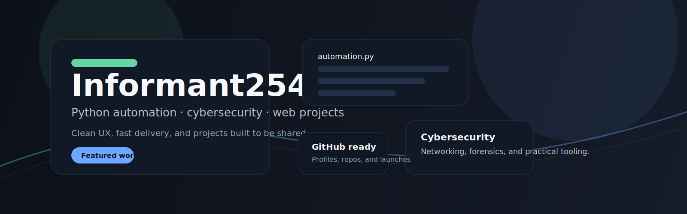

# 🛡️ Informant254

### Python Developer | Cybersecurity Enthusiast | Digital Product Architect

I build practical tools and storefronts with a bias for **clean UX, fast delivery, and clear outcomes.** Currently focused on bridging the gap between security and high-converting web applications.

---

## 🚀 Featured Projects

### 🌸 [Flourish Studio](https://github.com/Informant254/flourish-studio)
**Digital product storefront for planners, journals, and self-improvement downloads.**
- Built with: HTML, CSS, Vanilla JS
- Highlights: Mobile-first, SEO-ready, zero dependencies.
- [**Live Demo**](https://frabjous-frangipane-42c58d.netlify.app/)

### 🤖 Nairobi Elite Hub
**Telegram bot ecosystem and automation workflows.**
- Focus: Community automation and creator tools.

---

## 🛠️ Tech Stack

| Category | Tools & Languages |
| :--- | :--- |
| **Languages** | `Python`, `JavaScript`, `HTML5`, `CSS3` |
| **Platforms** | `Netlify`, `Vercel`, `GitHub Actions` |
| **Tools** | `Linux`, `Selar`, `Git`, `Bash` |
| **Focus** | `Automation`, `Cybersecurity`, `E-commerce` |

---

## 📈 GitHub Stats

---

## 📫 Connect with Me

- 💼 **Open to Collaborations**: Automation, Web Dev, and Digital Product projects.
- 🐦 **Twitter**: [Your Twitter Link Here]
- 📧 **Email**: charlesngatia713@gmail.com

---

> "Building products designed for African creators and mobile-first buyers."

⭐ *Don't forget to star my repos if you find them useful!*
